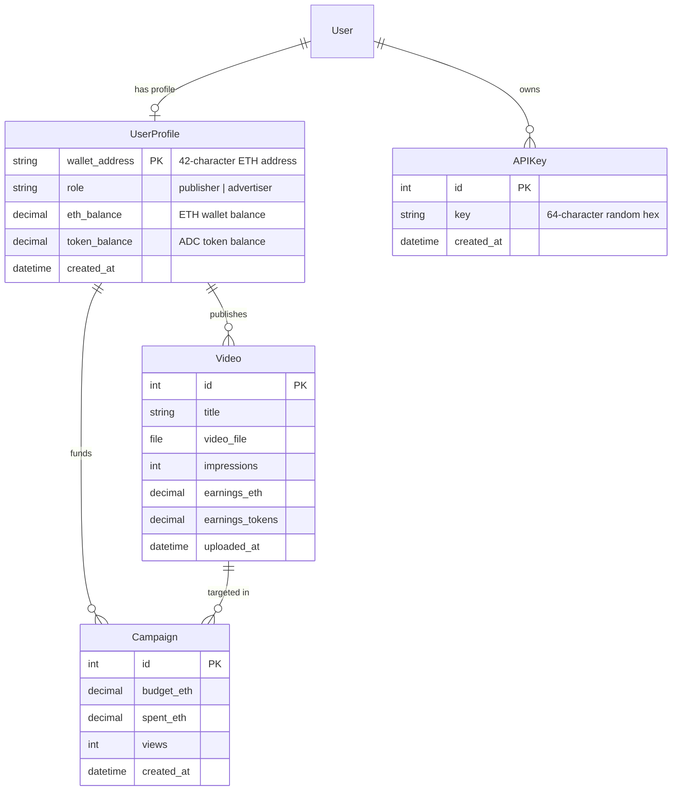

# 🔗 AdChain — Decentralized Web3 Advertising Network

<p align="center">
  
  
  
  
  
  
</p>

---

## 📖 Overview

**AdChain** is a full-stack decentralized advertising network built with **Django**, **Web3**, and **MetaMask**. It bridges content publishers and advertisers directly through transparent, non-custodial blockchain mechanisms, eliminating traditional advertising intermediaries and excessive platform fees.

Publishers earn instant cryptocurrency payouts (**ETH** and **ADC Tokens**) for verified video impressions, while advertisers can launch targeted video campaigns with real-time budget tracking and performance analytics.

---

## ✨ Key Features

### 🦊 Web3 & MetaMask Authentication
- **One-Click Wallet Connection**: Instant sign-in via MetaMask browser extension.
- **Dual-Layer Authentication**: Seamlessly pairs MetaMask wallet addresses with secure Django session and user accounts (`/login/`, `/select_role/`).
- **Account Switch Detection**: Real-time detection of MetaMask account or network changes with automatic session sync.
- **Role-Based Workflows**: Dedicated dashboards tailored for **Publishers** and **Advertisers**.

### 📹 Publisher Monetization Hub (`/publisher_dashboard/`)
- **Video Catalog & Management**: Upload and manage video inventory with metadata and playback tracking.
- **Real-Time Earnings Stream**: Track dual-currency earnings in **ETH** and **ADC Tokens**.
- **Impression Analytics**: Live impression metrics with real-time increment updates.
- **Interactive Ad View Simulator**: Test and verify earning mechanics per ad impression with dynamic balance calculation.

### 🎯 Advertiser Campaign Engine (`/advertiser_dashboard/`)
- **Campaign Launcher**: Create targeted video ad campaigns with custom ETH budgets.
- **Real-Time Budget Tracking**: Automatic balance deduction, live spent tracking, and impression telemetry.
- **Testnet Faucet / Balance Top-Up**: Simulated ETH deposit tool (`/add_eth/`) to fund ad campaigns during testing.
- **Publisher Video Discovery**: Browse available video inventory across the network to target optimal ad placements.

### 🔑 Developer API & Key Management (`/api_keys/`)
- **Cryptographic API Key Generation**: Generate 64-character secure hexadecimal API keys (`APIKey` model).
- **Manage & Revoke Keys**: View active keys and instantly revoke compromised keys directly from the dashboard.
- **SDK Authentication**: Authorize external applications and websites to stream ads and report telemetry securely.

### 📚 Interactive SDK Documentation (`/docs/`)
- **Publisher Integration Guide**: Step-by-step instructions for embedding the lightweight AdChain JavaScript SDK into any HTML website.
- **Event Listeners & Hooks**: Code samples for `adchain:ready`, `adchain:impression`, and `adchain:error`.
- **API Endpoint Documentation**: Complete REST API schema with request/response examples.

### 📊 Dynamic Market Analytics & Ticker
- **Live Token Price Chart**: Interactive Chart.js chart displaying dynamic ADC token price movements.
- **Network Statistics Bar**: Live platform-wide counters for registered users, hosted videos, total impressions, and active campaigns.

---

## 🛠️ Technology Stack

| Layer | Technologies |
|---|---|
| **Backend Framework** | [Django](https://www.djangoproject.com/) (Python 3.10+) |
| **Frontend & UI** | [Bootstrap 5](https://getbootstrap.com/), Custom Web3 Glassmorphism CSS, [Bootstrap Icons](https://icons.getbootstrap.com/) |
| **Blockchain / Web3** | [MetaMask](https://metamask.io/) Provider API (`window.ethereum`), Web3 JavaScript |
| **Data Visualization** | [Chart.js](https://www.chartjs.org/) |
| **Database** | SQLite3 (Development) / PostgreSQL (Production ready) |
| **Media & Storage** | Django Media Storage Engine (`/media/videos/`) |

---

## 📁 Project Structure

```text
Decentralized-AD-Network/
├── adchain/                       # Django Core Configuration
│   ├── __init__.py
│   ├── asgi.py
│   ├── settings.py               # Application settings, static & media configurations
│   ├── urls.py                   # Root URL routing
│   └── wsgi.py                   # WSGI deployment configuration
│
├── core/                          # Main Application Logic
│   ├── migrations/               # Database migration files
│   ├── admin.py                  # Django admin registrations
│   ├── apps.py                   # App configuration
│   ├── forms.py                  # Custom authentication & role selection forms
│   ├── models.py                 # UserProfile, Video, Campaign, and APIKey models
│   ├── urls.py                   # Application routes and API endpoints
│   └── views.py                  # View controllers & Web3 AJAX handlers
│
├── media/                         # Media Upload Directory
│   └── videos/                   # Stored publisher video files
│
├── static/                        # Static Assets (CSS, JS, Images, Icons)
│
├── templates/                     # HTML Templates
│   ├── base.html                 # Global layout, glassmorphic UI, navbar & footer
│   └── core/
│       ├── home.html             # Landing page with stats, feature showcase & price chart
│       ├── select_role.html      # Role selection & registration page
│       ├── custom_login.html     # Dual MetaMask + Password login page
│       ├── publisher_dashboard.html   # Publisher video & earnings management
│       ├── advertiser_dashboard.html  # Advertiser campaigns & budget management
│       └── documentation.html    # Developer SDK documentation & API key modal
│
├── db.sqlite3                    # Local SQLite database
├── manage.py                     # Django CLI utility
├── requirements.txt              # Project Python dependencies
└── README.md                     # Project documentation
```

---

## 🗄️ Database Schema



---

## 🚀 Quick Start Guide

### Prerequisites

- **Python 3.9+** installed on your system.
- **MetaMask** browser extension installed ([Download MetaMask](https://metamask.io/download/)).
- **Git** installed on your system.

---

### Step 1: Clone the Repository

```bash
git clone https://github.com/Prabhatmaurya3239/Decentralized-AD-Network.git
cd Decentralized-AD-Network
```

---

### Step 2: Create and Activate Virtual Environment

**Windows (PowerShell):**
```powershell
python -m venv venv
.\venv\Scripts\Activate.ps1
```

**Windows (Command Prompt):**
```cmd
python -m venv venv
venv\Scripts\activate.bat
```

**macOS / Linux:**
```bash
python3 -m venv venv
source venv/bin/activate
```

---

### Step 3: Install Dependencies

```bash
pip install -r requirements.txt
```

---

### Step 4: Apply Database Migrations

```bash
python manage.py makemigrations
python manage.py migrate
```

---

### Step 5: Create a Superuser (Optional - for Django Admin)

```bash
python manage.py createsuperuser
```

---

### Step 6: Start the Development Server

```bash
python manage.py runserver
```

Open your browser and navigate to:
```
http://127.0.0.1:8000/
```

---

## 🧭 Application Walkthrough

### 1. Connecting Your MetaMask Wallet
1. Open `http://127.0.0.1:8000/` in a browser with the MetaMask extension.
2. Click **Connect MetaMask** in the navigation bar.
3. Approve the connection request in the MetaMask popup.
4. If it is your first time connecting, you will be redirected to `/select_role/` to register your account as a **Publisher** or **Advertiser**.

### 2. For Publishers
- Navigate to `/publisher_dashboard/`.
- Upload video content specifying the title and video file.
- View live telemetry for impressions, ETH earnings, and ADC tokens.
- Use the **Simulate Ad View** button to trigger automated impression rewards and verify balance increments in real time.

### 3. For Advertisers
- Navigate to `/advertiser_dashboard/`.
- Use the **Add ETH** faucet tool to deposit test funds into your advertiser account.
- Browse available publisher videos and click **Create Campaign** to set your ETH budget.
- Track campaign views and real-time budget spending.

### 4. For Developers & External Integrations
- Navigate to `/docs/` to view the **Publisher SDK Documentation**.
- Click **Get API Key** to generate a unique 64-character API key for programmatic access.
- Embed the AdChain JavaScript SDK snippet into any third-party website to display ads.

---

## 📡 API Reference

| Method | Endpoint | Description | Auth Required |
|---|---|---|---|
| `GET` | `/` | Platform landing page & live price chart | No |
| `POST` | `/connect_wallet/` | Authenticate MetaMask wallet address via AJAX | No |
| `GET/POST` | `/select_role/` | Register new user profile with selected role | No (Wallet session) |
| `GET/POST` | `/login/` | Dual MetaMask + Password login view | No |
| `GET` | `/logout/` | Terminate user session and clear wallet data | Yes |
| `GET` | `/publisher_dashboard/` | Publisher dashboard & earnings tracker | Yes (`publisher`) |
| `GET/POST` | `/advertiser_dashboard/`| Advertiser dashboard & video upload | Yes (`advertiser`) |
| `POST` | `/simulate_ad_view/<id>/`| Increment impression counter & reward publisher | No (AJAX) |
| `POST` | `/add_eth/` | Top up advertiser ETH balance (demo faucet) | Yes (AJAX) |
| `POST` | `/create_campaign/` | Create a new ad campaign on a video | Yes (AJAX) |
| `GET` | `/api_keys/` | Fetch list of active API keys for logged-in user | Yes |
| `POST` | `/create_api_key/` | Generate a new 64-character API key | Yes |
| `POST` | `/delete_api_key/` | Delete/revoke an active API key | Yes |
| `GET` | `/docs/` | Interactive SDK documentation portal | No |

---

## 💻 Publisher SDK Integration Example

Embed decentralized video ads into any web page with just a few lines of code:

```html
<!-- AdChain Container -->
<div id="adchain-placement-1" 
     data-adchain-key="YOUR_API_KEY" 
     data-theme="dark" 
     data-width="640">
</div>

<!-- AdChain SDK Script -->
<script src="https://cdn.adchain.network/v2/sdk.min.js" async></script>
<script>
  window.addEventListener('adchain:impression', function(e) {
    console.log('Verified impression recorded:', e.detail.rewardEth, 'ETH');
  });
</script>
```

---

## 🔒 Security Architecture

- **Session Hardening**: Sessions are securely linked to verified MetaMask wallet addresses and Django authentication middleware.
- **CSRF Token Protection**: All state-modifying requests require valid Django CSRF tokens.
- **Cryptographic Keys**: API keys are generated using cryptographically secure pseudorandom token generators (`secrets.token_hex(32)`).
- **Input & File Validation**: Uploaded media formats and payload parameters undergo strict backend validation.

---

## 🗺️ Roadmap & Future Enhancements

- [ ] **Smart Contract Integration**: Direct settlement via Solidity smart contracts on Polygon / Arbitrum.
- [ ] **Decentralized Storage (IPFS / Arweave)**: Decentralized hosting for all uploaded video ads.
- [ ] **ERC-20 ADC Token Deployment**: Deploy real ADC ERC-20 tokens on Ethereum testnets (Sepolia).
- [ ] **Zero-Knowledge View Verification**: ZK-proofs for privacy-preserving, fraud-proof impression verification.
- [ ] **Real-Time WebSockets**: Instant updates for price charts and impression feeds via Django Channels.

---

## 🤝 Contributing

Contributions, issues, and feature requests are welcome!

1. Fork the repository
2. Create your feature branch (`git checkout -b feature/AmazingFeature`)
3. Commit your changes (`git commit -m 'Add some AmazingFeature'`)
4. Push to the branch (`git push origin feature/AmazingFeature`)
5. Open a Pull Request

---

## 📄 License

This project is licensed under the **MIT License** — see the [LICENSE](LICENSE) file for details.

---

<p align="center">
  <b>Built with ❤️ for the Decentralized Web</b>
</p>
